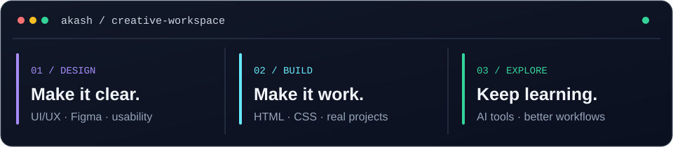
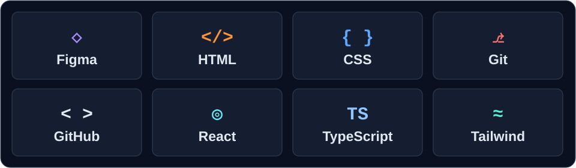

  

<h1 align="center">Hi, I'm AKASH (Pronab) 👋</h1>

<strong>UI/UX Designer · Digital Builder · AI Explorer</strong>

I design clear, useful interfaces and turn ideas into digital experiences.

  <a href="mailto:akashchakraborty606@gmail.com">✉️ Email</a> ·
  <a href="https://www.linkedin.com/in/pronab-chakraborty-b413bb80/">LinkedIn</a> ·
  <a href="https://github.com/Akashch001?tab=repositories">GitHub repositories</a>

---

### ✦ About me

I'm a UI/UX designer and freelancer building a global career through practical projects. I care about visual hierarchy, approachable interfaces, and the small details that make a product easier to use. I work in Figma, understand HTML and CSS, and explore AI tools that help with design and productivity.

| 🎨 Design | 🌐 Web | 🧭 Right now |
| :--- | :--- | :--- |
| UI/UX, interface design, Figma | HTML, CSS, Git & GitHub | Portfolio work, design practice, AI experiments |

  

### ✦ Projects in the workspace

| Project | What it explores |
| :--- | :--- |
| **[NexusCV](https://github.com/Akashch001/NexusCV)** | An open-source resume builder with an editorial interface and ATS-focused tools. |
| **[Andy Portfolio](https://github.com/Akashch001/Andy-Portfolio)** | An interactive portfolio built with React, TypeScript, Tailwind CSS, and motion. |

[Browse all repositories →](https://github.com/Akashch001?tab=repositories)

### ✦ Languages, frameworks & tools

  

**Core tools:** Figma · HTML · CSS · Git · GitHub  
**Used in linked projects:** React · TypeScript · Tailwind CSS

### ✦ GitHub activity

GitHub shows my live contribution graph and recent work directly on [my profile](https://github.com/Akashch001). You can also explore the projects above to see what I'm building.

### ✦ Let's create something useful

I'm open to website and app design collaborations, freelance work, and conversations with design teams. Tell me what you're building and who it is for.

**[Email me](mailto:akashchakraborty606@gmail.com)** · **[Connect on LinkedIn](https://www.linkedin.com/in/pronab-chakraborty-b413bb80/)**

---

Support my independent work

If you'd like to support my learning and projects, thank you.

[Support via PayPal](https://www.paypal.me/pronabchakraborty87)

**USDT (TRC20):**  
`TLDn7EsmtfXbP1YbJaS1sW7DYTQPYV4t2C`

