  

# AKASH (Pronab)

**UI/UX Designer · Freelancer · AI Explorer**

I design clean, user-friendly digital experiences and bring a practical understanding of HTML and CSS to my work. I’m building a global freelancing career through real-world projects, while exploring how AI can improve design and everyday productivity.

**Open to website and app design collaborations, freelance projects, and conversations with design teams.**

[Discuss a project →](mailto:akashchakraborty606@gmail.com) · [Connect on LinkedIn](https://www.linkedin.com/in/pronab-chakraborty-b413bb80/) · [Explore my repositories](https://github.com/Akashch001?tab=repositories)

---

## 01 / Design workspace

My focus is simple: make digital products easier to understand and more enjoyable to use.

| Focus | What I bring |
| :--- | :--- |
| **Website & app interfaces** | Clean layouts, clear visual hierarchy, and attention to the user experience. |
| **Design & implementation** | Figma for interface design, with HTML and CSS knowledge to connect design decisions to the web. |
| **AI-assisted workflows** | An exploratory approach to AI tools for design, learning, and productivity. |

## 02 / Toolbox

**Design** — Figma · UI/UX  
**Web** — HTML · CSS  
**Version control** — Git · GitHub  
**Exploring** — AI tools for design & productivity

## 03 / Currently building

- **Portfolio:** developing UI/UX projects that show how I think about interface design.
- **Practice:** learning advanced UI/UX through hands-on, real-world work.
- **Collaboration:** connecting with people building websites and apps, including international clients.
- **Experiments:** trying AI tools and learning where they fit into a useful design workflow.

[Browse my work on GitHub →](https://github.com/Akashch001?tab=repositories)

> Building my career through practical skills and real projects.

## 04 / Start a conversation

Have a website or app idea, a design collaboration, or an opportunity on your team? Send me a short note about what you’re building, who it’s for, and the help you need.

**Email:** [akashchakraborty606@gmail.com](mailto:akashchakraborty606@gmail.com)  
**LinkedIn:** [Pronab Chakraborty](https://www.linkedin.com/in/pronab-chakraborty-b413bb80/)

I’m also happy to talk about design, freelancing, and the tools we use to create.

---

Support my learning & independent work

If you’d like to support my journey, thank you.

[Support via PayPal](https://www.paypal.me/pronabchakraborty87)

**USDT (TRC20):**  
`TLDn7EsmtfXbP1YbJaS1sW7DYTQPYV4t2C`

